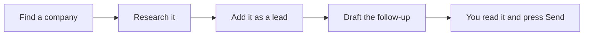

# Tark Automation

**Tell it what you want in plain words. It does the clicking in Tark.**

Tark Automation pairs an AI assistant ([Claude Code](https://claude.ai/code)) with your
Tark account. You talk; it fills in leads, drafts quotes and follow-up emails, and keeps
your projects, tasks and hours in order. You stay in charge of everything that leaves
the building.

**Tark at a glance:** Tark runs sales, projects, production, workforce and finance for
manufacturers. The assistant works with four of those areas today: sales, projects,
time and clients.

**Example — a sales morning:**



That's one area. Here's everything else it can do for you.

---

## What you can do

### Sales

> **Say:** *"Research www.example.ee and add them as a lead."*

You get a one-page brief (what they make, how big they are, who runs it, recent news),
then the lead appears in **Sales → Leads** with the company and contact filled in.
Facts only — anything it couldn't find is marked unknown, never guessed. Got a list?
*"Add these twenty companies as leads"* — duplicates are skipped. Later:
*"Move Acme to Qualified."*

> **Say:** *"Which leads are due for a follow-up? Draft the emails."*

Tark knows when each lead is due. The assistant drafts every due email from your own
templates and leaves them in **Sales → Follow-ups**. You skim, tweak and confirm.

> **Say:** *"Make a quote for Acme: 200 oak panels at 45 euros each, plus delivery."*

A quote with its lines appears under Acme in Tark, ready for you to check.

### Projects & teamwork

> **Say:** *"What's on my plate today?"* · *"Create a task in the Website project:
> refresh the price list, high priority, due Friday."*

Your open tasks across every project, and new tasks in seconds — with priority, due
date and the right person assigned.

> **Say:** *"What's blocking the launch task?"* · *"Comment on it: waiting for photos."*

It shows which tasks hold this one up (and what it holds up in turn), and leaves notes
where the whole team can see them.

> **Say:** *"Turn this meeting list into tasks on the Website board."*

One message, a whole board of tasks. Ones that already exist are skipped.

### Time

> **Say:** *"Start a timer on the Acme quote."* · *"Stop the timer."*

> **Say:** *"Log 1.5 hours to the site visit."*

Hours land on the right task, not in a spreadsheet.

> **Say:** *"What did I work on this week?"*

Your hours for the week, split by project — ready for invoicing.

### Clients & contracts

> **Say:** *"Add Acme OÜ as a client, registry code 12345678."* · *"Update Acme's
> billing address."*

The client record is created or corrected in Tark, so quotes and contracts pick up the
right details.

> **Say:** *"Start a contract for Acme from our service agreement template."*

A new contract for Acme, built on your own template, waiting in Tark for you to review.

---

## You're always in charge

- **Nothing is sent without you.** The assistant can only write drafts. Sending an email
  takes a person pressing **Confirm** in Tark — the automation is blocked from doing it.
- **It sees what you see — nothing more.** It works with your personal access key, so it
  can never do more than you can in Tark. You can switch the key off any time.
- **Your work lives in Tark**, not on a laptop. Close the window; nothing is lost.

---

## Get started in 3 minutes

**In your browser — nothing to install.** Open [claude.ai/code](https://claude.ai/code),
pick this repository (`TarkToostus/automation`) and say *"Set me up"*.

**On your computer.** One line in Terminal (Mac) or PowerShell (Windows):

```bash
curl -fsSL https://raw.githubusercontent.com/TarkToostus/automation/main/setup.sh | bash
```

```powershell
irm https://raw.githubusercontent.com/TarkToostus/automation/main/setup.ps1 | iex
```

You'll need a paid Claude plan and a Tark access key (**Profile → Security → API keys**
in Tark). Step-by-step help: **[Getting started](docs/GETTING-STARTED.md)** ·
ready-made phrases to copy: **[Prompt cookbook](docs/PROMPTS.md)**.

---

## For developers

Under the hood it's `tark_cli.py` — one Python file, no dependencies — talking to the Tark
API with a Personal Access Token.

- **[Command reference](docs/COMMANDS.md)** — every command, auth, output formats, endpoints
- **[Examples](examples/)** — short scripts: dashboard, time logging, bulk import, weekly report

Found a security issue? Email `security@tarktoostus.ee` rather than opening a public issue.

MIT licensed — see [LICENSE](LICENSE).
